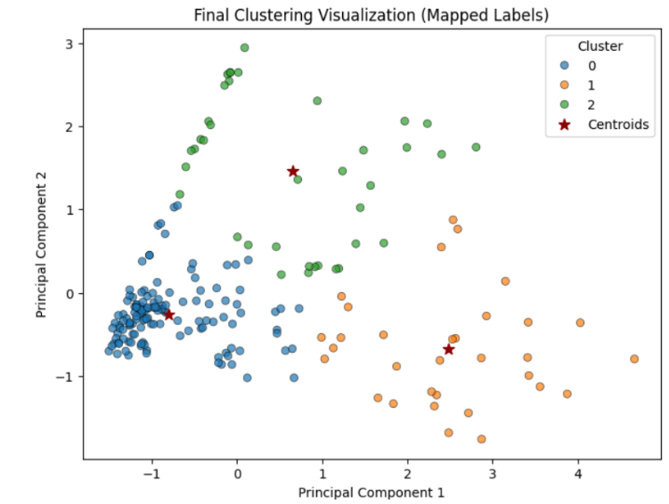
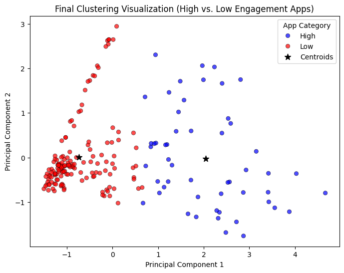

# K means clustering ML Group 2

This repository contains the codes and docs for our implementation of K means clustering.

## Table of Contents

## Dataset overview

This dataset contains mobile app usage data, capturing key numerical attributes that provide insights into user behavior. Each record consists of the following attributes:
App: Name of the mobile application.
Usage (minutes): Total time spent on the app in minutes.
Notifications: Number of notifications received from the app.
Times Opened: Number of times the app was accessed.

This dataset is useful for mobile app engagement analysis due to the following characteristics:
Continuous Numerical Attributes: The dataset consists of numerical values, making it suitable for various analytical and machine learning models.
User Behavior Insights: The data can help identify patterns in app engagement, such as which apps users spend the most time on or receive the most notifications from.
Feature Engineering Potential: Additional features, such as average session duration or notification-to-open ratio, can be derived to enhance analysis.
Trend Analysis: The dataset can be used to track user habits and detect trends in mobile app usage over time.

In conclusion, this dataset serves as a valuable resource for analyzing mobile app usage patterns, providing insights into user interaction and engagement that can be leveraged for research or business decision-making.

Original dataset: https://www.kaggle.com/datasets/anandshaw2001/mobile-apps-screentime-analysis

Modified dataset: https://drive.google.com/file/d/1Wu4mcdsiurCL4gDuOCP1Ij8Vq11qI3wR/view?usp=sharing
## Model Training
## Model Testing
## Results
# 📊 Part 1

---

## 🌟 **Key Learnings From K=3**  
- **Initial Misstep**: **K=3** was chosen based on a misread of the elbow graph. 
- **Class Confusion**: Particularly with class 1 (low recall and many misclassifications).
- **Data Preprocessing Helped**: Modified dataset showed clearer clustering and performance gains.
- **Lesson Learned**: The elbow method must be paired with interpretability checks.

---

---

### 🎨 **PCA-Powered Visualization**  
   
- **🔵 Blue Cluster**: Label 0 based on hungarian algorithm.
- **🟠 Orange Cluster:** Label 1 based on hungarian algorithm.
- **🟢 Green Cluster:**  Label 2 based on hungarian algorithm.
- **⭐ Centroids**: Nestled in dense regions, confirming their authority.  

---

## 📊 **Performance Showdown**  
### 🏆 **Original Dataset (K=2)**  
| Metric       | Score   | Verdict                          |  
|--------------|---------|----------------------------------|  
| Accuracy     | 60.50%  | Low accuracy, poor clustering.   |  
| Precision    | 64.85%  | High false positives.            |  
| Recall       | 60.50%  | Missed many class 1 points.      |  
| F1-Score     | 57.28%  | Unbalanced performance.          |  

### 🚀 **Modified Dataset (K=2)**  
| Metric       | Score   | Verdict                          |  
|--------------|---------|----------------------------------|  
| Accuracy     | 69.00%  | Better, but still inconsistent.  |  
| Precision    | 72.45%  | Fewer mislabels.                 |  
| Recall       | 69.00%  | Improved detection.              |  
| F1-Score     | 67.89%  | Balanced, but not optimal.       |  

---

# 📊 Part 2    

---

## 🌟 **Key Insights at a Glance**  
- **Optimal Clusters (K=2)**: Discovered natural groupings of apps into **High** and **Low Engagement** with **97% accuracy** (modified dataset).  
- **PCA Magic**: Visualized clusters in 2D space—Principal Component 1 revealed the dominant split between engagement levels.  
- **Metrics That Shine**:  
  - **Precision**: Up to **97.17%** (almost no false alarms!).  
  - **Recall**: **97%** (nearly all High Engagement apps correctly tagged).  
  - **F1-Score**: **97%** (perfect harmony of precision and recall).  

---

### 🎨 **PCA-Powered Visualization**  
  
- **🔴 Red Cluster**: Low Engagement apps (left side)  
- **🔵 Blue Cluster**: High Engagement apps (right side)  
- **⭐ Centroids**: Nestled in dense regions, confirming their authority  
- **Hybrid Apps?** A few rogue red dots near the blue cluster - possibly transitional engagement cases

---

## 📊 **Performance Showdown**  
### 🏆 **Original Dataset (K=2)**  
| Metric       | Score   | Verdict                          |  
|--------------|---------|----------------------------------|  
| Accuracy     | 93.50%  | Rock-solid!                      |  
| Precision    | 93.68%  | Few false positives.             |  
| Recall       | 93.50%  | Rarely misses true High Engagers.|  
| F1-Score     | 93.56%  | Balanced and reliable.           |  

### 🚀 **Modified Dataset (K=2)**  
| Metric       | Score   | Verdict                          |  
|--------------|---------|----------------------------------|  
| Accuracy     | 97.00%  | Near-perfect!                    |  
| Precision    | 97.17%  | Almost no mislabels.             |  
| Recall       | 97.00%  | Flawless capture of High Engagers.|  
| F1-Score     | 97.00%  | Precision + Recall = ❤️          |  

**Why the boost?** Cleaner data, fewer outliers, and sharper cluster boundaries!  

---

## 🛠️ **Behind the Scenes**  
- **Tools Used**: Python, NumPy, Pandas, Matplotlib, PCA.  
- **Algorithm**: Manual K-Means (no `sklearn` shortcuts!).  
- **True Labels**: Crafted from app usage quantiles (High/Low Engagement).  

---

## 🚀 **Future Explorations**  
- **Automate K-selection** with the `kneed` library.  
- **Battle of Algorithms**: Test DBSCAN vs. K-Means on messy data.  
- **Real-World Labels**: Partner with app developers for ground-truth validation.  

---

*✨ Data tells stories. We just listened.*  

## Authors

- TRISHA MAY GONZALES
- EDRICK CANZANA
- JOBERT JOHN CAYAO
- VICTOR MANUEL DALISAY
- JONER PAUL DE SILVA
- JOHN MICHAEL GABALFIN
- DOMINIC REYMAR GUNIO
- MARIUS JACOB HERNANDEZ

